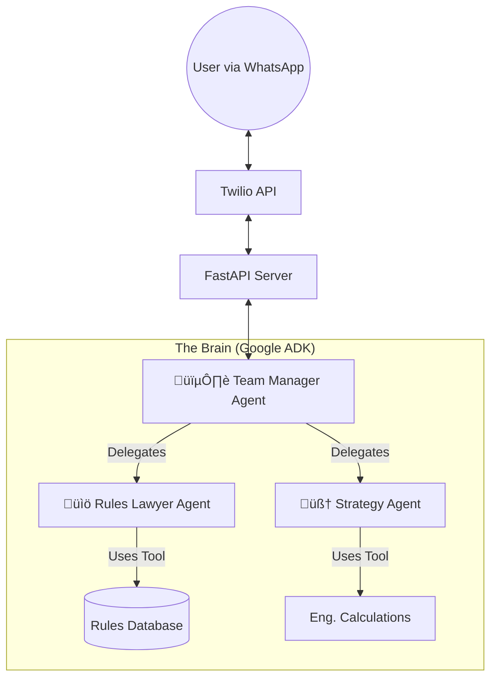

# 🏎️ Formula Student Co-Pilot (FS-AI)

**Your AI Race Engineer, available 24/7 on WhatsApp.**


## üìñ About The Project

**Formula Student Co-Pilot** is a Multi-Agent AI system designed to assist Formula Student / FSAE teams with engineering decisions, rule compliance, and design strategy. 

Instead of searching through hundreds of pages of PDF regulations in the garage, engineers can simply text the bot via **WhatsApp** to get instant, cited answers regarding chassis constraints, material selection, and safety rules.

Built using **Google's Agent Development Kit (ADK)** and **Gemini Models**, the system uses a "Team Manager" architecture to delegate tasks to specialized sub-agents.

## ⚙️ Architecture

The system follows a **Hub-and-Spoke Multi-Agent Pattern**:


* **Team Manager:** The interface agent that maintains conversation context and routes queries.
* **Rules Lawyer:** Specialized agent with access to technical regulations (FSAE/FSG).
* **Strategy Agent:** Provides engineering advice and design trade-off analysis.

## ‚ú® Key Features

* **💬 WhatsApp Integration:** Frictionless interface for mechanics and engineers working in the garage.
* **üìö Regulation RAG (Retrieval):** Instantly validates design ideas against specific rules (e.g., *"Is a 30mm steel tube allowed for the Main Hoop?"*).
* **🧠 Context Aware:** Remembers previous design constraints discussed in the conversation.
* **üîß Tool Use:** Agents can perform lookups and calculations rather than just hallucinating answers.

## 🛠️ Tech Stack

* **LLM Orchestration:** Google GenAI (Gemini) via Google ADK
* **Backend:** Python, FastAPI
* **Messaging:** Twilio API (WhatsApp Sandbox)
* **Hosting:** Replit (Development)
* **Database:** SQLite (Prototyping) -> PostgreSQL (Planned)

## üöÄ Getting Started

### Prerequisites
* Python 3.10+
* Twilio Account (for WhatsApp Sandbox)
* Google Cloud Project (for Gemini API Key)

### Installation

1.  **Clone the repository**
    ```bash
    git clone [https://github.com/yourusername/fs-copilot.git](https://github.com/yourusername/fs-copilot.git)
    cd fs-copilot
    ```

2.  **Install Dependencies**
    ```bash
    pip install fastapi uvicorn python-multipart google-genai twilio
    ```

3.  **Configure Environment Variables**
    Create a `.env` file (or set Secrets in Replit):
    ```ini
    GOOGLE_API_KEY=your_gemini_key
    TWILIO_ACCOUNT_SID=your_sid
    TWILIO_AUTH_TOKEN=your_token
    TWILIO_PHONE_NUMBER=whatsapp:+14155238886
    ```

4.  **Run the Server**
    ```bash
    uvicorn main:app --host 0.0.0.0 --port 8080
    ```

5.  **Connect Webhook:** Set your Twilio Sandbox URL to `https://<your-url>/twilio`.

## üì∏ Demo Interaction

> **User:** "I want to use a 30mm steel tube for the Main Hoop. Is that allowed?"
>
> **FS Co-Pilot:** "Checking Rule T3.2.2... That is **not compliant**.
> The rule requires a minimum outer diameter of 38mm for the Main Hoop if using standard steel.
> *Suggestion:* You could use 30mm for the Side Impact Structure, but for the Main Hoop, you must increase the diameter."

## 🗺️ Roadmap

- [x] Basic Conversation Loop (Team Manager)
- [x] WhatsApp Integration (Twilio)
- [x] Tool Implementation (Rules Lookup)
- [ ] **Day 8:** Migrate Memory to PostgreSQL (Persistent Storage)
- [ ] **Phase 2:** Image Recognition (Send a photo of a part to identify issues)

## 🤝 Contributing

Contributions are welcome! Please open an issue to discuss proposed changes.

## 📄 License

Distributed under the MIT License. See `LICENSE` for more information.
